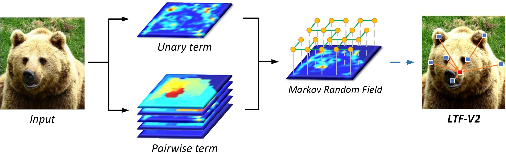

# Learnable Tree Filter V2
By [Lin Song](https://linsong.me), [Yanwei Li](https://yanwei-li.com), [Zhengkai Jiang](https://jiangzhengkai.github.io), [Zeming Li](http://www.zemingli.com), [Xiangyu Zhang](https://scholar.google.com/citations?user=yuB-cfoAAAAJ&hl=en), [Hongbin Sun](http://gr.xjtu.edu.cn/web/hsun/chinese), [Jian Sun](http://www.jiansun.org), Nanning Zheng.

This repo is an official implementation for "[Rethinking Learnable Tree Filter for Generic Feature Transform](https://papers.nips.cc/paper/2020/file/2952351097998ac1240cb2ab7333a3d2-Paper.pdf)" (NeurIPS2020) on PyTorch framework. 



## Installation
### Requirements
- Python >= 3.6
- PyTorch >= 1.6 and torchvision
- OpenCV, needed by demo and visualization
- pycocotools: 
	- `pip install cython`
	- `pip install 'git+https://github.com/cocodataset/cocoapi.git#subdirectory=PythonAPI'`
- prodict:
  - `pip install prodict`
- GCC >= 4.9

### Build from source
- `git clone https://github.com/StevenGrove/LearnableTreeFilterV2`
- `cd LearnableTreeFilterV2`
- `python setup.py build develop`
### Prepare data
See [datasets/README.md](datasets/README.md).

## Usage
All the projects are placed in  [cvpods_playground](cvpods_playground). You need to select a project and enter the corresponding folder.
```
# For example
cd cvpods_playground/mask_rcnn.res50.fpn.coco.1x.nn_syncbn.tf-v2
```

### Training
```
# Running training procedure with specific GPU number
cvpods_train --gpu-nums <GPU_NUM> [optional arguments]

# Please refer to tools/train_net.py for more optional arguments
```

### Inference
```
# Running inference procedure with specific GPU number
# The program will load the lastest model weights from ./log folder
cvpods_test --gpu-nums <GPU_NUM> [optional arguments]

# Running inference procedure with specific GPU number and model path
cvpods_test --gpu-nums <GPU_NUM> MODEL.WEIGHTS <model_path> [optional arguments]

# Please refer to tools/test_net.py for more optional arguments
```

### Visualize your image [Optional]
```
# Please refer to demo/demo.py for more optional arguments
python ../../demo/demo.py --config <config_path> --input <input_path> --output <output_path> MODEL.WEIGHTS <model_path> [optional arguments]
```

### Add  to your code [Optional]
```
# Load the learnable tree filter module
from cvpods.layers import TreeFilterV2

# Initialize the module with specific number of channels and groups
tf = TreeFilterV2(<guide_channels>, <in_channels>, <embed_channels>, [num_groups])

# Run the filter procedure with input feature and guided feature
output_feature = tf(<input_feature>, <guided_feature>)
```

## Performance

### Instance Segmentation on COCO *val* set
 Method | Backbone | Schedule | AP<sub>box</sub> (%) |  AP<sub>mask</sub> (%)  | Project | Model
:--|:--:|:--:|:--:|:--:|:--:|:--:
 Mask-RCNN + LTF-V2 | ResNet-50 | 1x | 41.3 | 37.0 | [Link](cvpods_playground/mask_rcnn.res50.fpn.coco.1x.nn_syncbn.tf-v2) | [OneDrive](https://stuxjtueducn-my.sharepoint.com/:u:/g/personal/stevengrove_stu_xjtu_edu_cn/EW-xLWNueF5AhfiZND3629kBcAJX5lkqjVH0v1tOoKhj4g?e=ONjwkJ) 
 Mask-RCNN + LTF-V2 | ResNet-101 | 1x | 42.5 | 38.0 | [Link](cvpods_playground/mask_rcnn.res101.fpn.coco.1x.nn_syncbn.tf-v2) | [OneDrive](https://stuxjtueducn-my.sharepoint.com/:u:/g/personal/stevengrove_stu_xjtu_edu_cn/EfwmbE6G-wVOpqigQI4ufwsBGvku_rIy2fSjWTF31omLhw?e=WJ4O35) 
 Mask-RCNN + LTF-V2 | ResNeXt-101 | 1x | 44.5 | 39.5 | [Link](cvpods_playground/mask_rcnn.x101.fpn.coco.1x.nn_syncbn.tf-v2) | [OneDrive](https://stuxjtueducn-my.sharepoint.com/:u:/g/personal/stevengrove_stu_xjtu_edu_cn/Ea9aXXBIQeBAqDhopUPo_XwBwIYXPs9B-nqCuVQ638TfEw?e=NzB1l3) 
 Cascade Mask-RCNN + LTF-V2 | ResNeXt-101 | 1x | 46.9 | 40.3 | [Link](cvpods_playground/cascade.x101.fpn.coco.1x.nn_syncbn.tf-v2) | [OneDrive](https://stuxjtueducn-my.sharepoint.com/:u:/g/personal/stevengrove_stu_xjtu_edu_cn/EeE4XLyBSdVOgYA3tixn-gQBrZ0GzUKUO65424YY0Nh3zQ?e=7O5cnJ) 

### Panoptic Segmentation on COCO *val* set

| Method                | Backbone  | Schedule | PQ (%) | AP<sub>box</sub> (%) | AP<sub>mask</sub> (%) |                           Project                            |                            Model                             |
| :-------------------- | :-------: | :------: | :----: | :------------------: | :-------------------: | :----------------------------------------------------------: | :----------------------------------------------------------: |
| Panoptic-FPN          | ResNet-50 |    1x    |  39.2  |         37.4         |         33.6          | [Link](cvpods_playground/panoptic_fpn.res50.fpn.coco.1x.nn_syncbn) | [OneDrive](https://stuxjtueducn-my.sharepoint.com/:u:/g/personal/stevengrove_stu_xjtu_edu_cn/EXQgJ3Q7DWhIoiZDH6t-rhEBBI3Bl9ulEhZBkDdLzSdABQ?e=mCgWhg) |
| Panoptic-FPN + LTF-V2 | ResNet-50 |    1x    |  41.7  |         39.3         |         35.4          | [Link](cvpods_playground/panoptic_fpn.res50.fpn.coco.1x.nn_syncbn.tf-v2) | [OneDrive](https://stuxjtueducn-my.sharepoint.com/:u:/g/personal/stevengrove_stu_xjtu_edu_cn/Ef4H8Pe_XahEmXaloEI260cBzyviRyI_u2w8ANWB24CSog?e=RwaELg) |

### More Results is Coming


## To do
- [x] Experiments on panoptic segmentation
- [ ] Easier installation based on pip
- [ ] Modify transformer
- [ ] Application on video tasks

## Citation

Please cite the paper in your publications if it helps your research.

```
@inproceedings{song2020rethinking,
    title = {Rethinking Learnable Tree Filter for Generic Feature Transform},
    author = {Song, Lin and Li, Yanwei and Jiang, Zhengkai and Li, Zeming and Zhang, Xiangyu and Sun, Hongbin and Sun, Jian and Zheng, Nanning},
    booktitle = {Advances in Neural Information Processing Systems},
    year = {2020}
}
```

Please cite this project in your publications if it helps your research.
```
@misc{learnabletreefilterv2,
    author = {Song, Lin},
    title = {LearnableTreeFilterV2},
    howpublished = {\url{https://github.com/StevenGrove/LearnableTreeFilterV2}},
    year = {2020}
}
```
